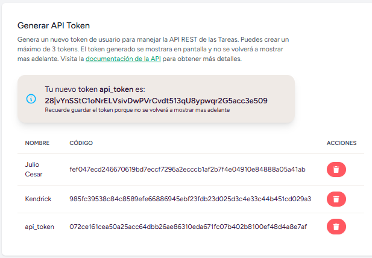
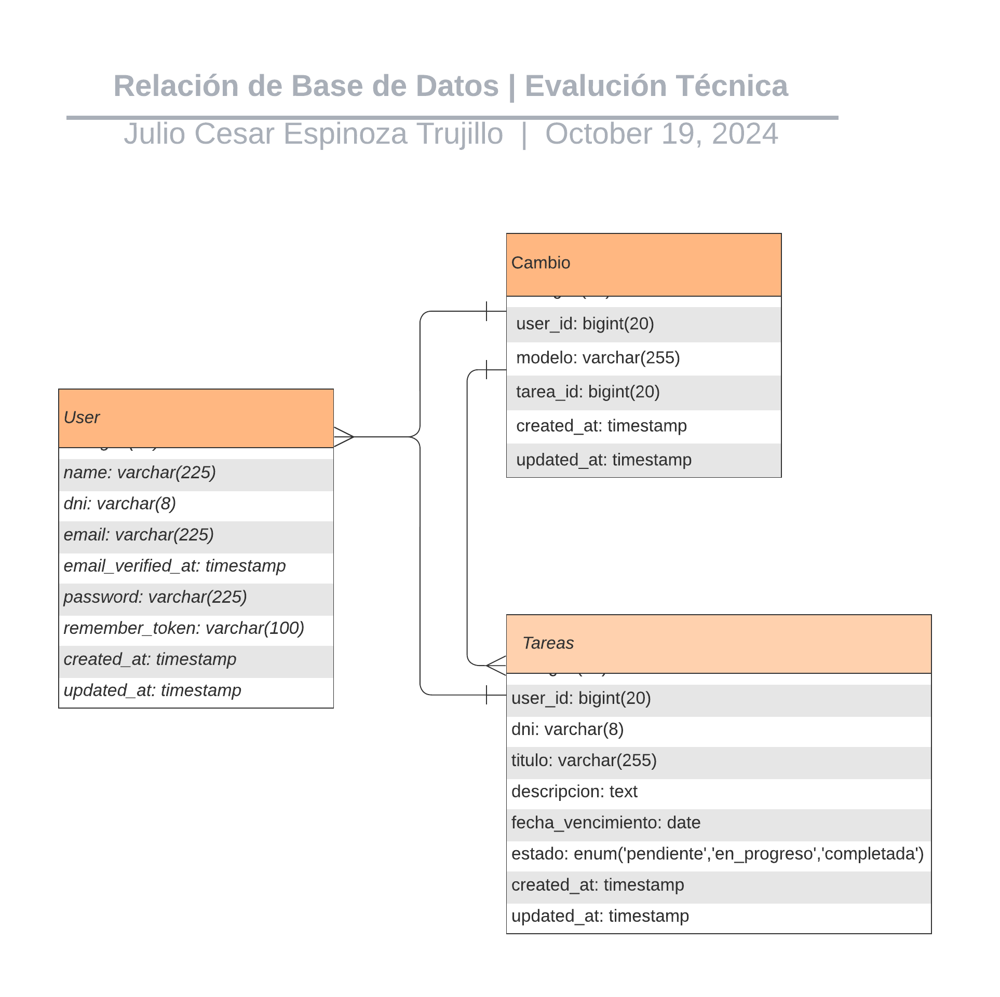

<p align="center"><a href="https://laravel.com" target="_blank"></a></p>

<p align="center">
<a href="https://packagist.org/packages/laravel/framework"></a>
</p>

## Evaluación Técnica

Este es un proyecto de aprendizaje que brinda la solución a una <a href="public/pdf/evaluacion-tecnica.pdf">evaluación técnica</a> de Laravel. Dentro de este proyecto podemos encontrar lo diferentes conceptos y características que el framework nos proporciona. Tales como:

- Migraciones.
- Rutas.
- Controladores.
- Requests.
- Factories.
- ORM Eloquent.
- Vistas de Blade.
- Relaciones.
- API

Laravel facilita la creación de aplicaciones gracias a estos conceptos, todos manejados por comandos de artisan.

Adicionalmente hay algunas herramientas extra que he utilizado, tales como:

- Tailwind CSS
- Daisy UI
- MySQL

## Instalación

El proyecto esta realizado en Laravel por lo que queda mas que claro que se debe instalar PHP, Composer y Node. En mi caso estoy utilizado XAMPP para acceder a una base de datos MySQL por medio de PhpMyAdmin y PHP en su version 8.2. Además para clonar este proyecto se debe tener instalado Git.

1. Clonación del repositorio.

    ```bash
    git clone https://github.com/taylorotwell/learn-laravel.git
    ```

2. Accedemos a la carpeta del proyecto.

    ```bash
    cd evaluacion-tecnica
    ```

3. Instalación de Composer.

    ```bash
    composer install
    ```
4. Instalación de Node.

    ```bash
    npm install
    ```

Antes de empezar a ejecutar el proyecto, no olvidar que tenemos que ejecutar MySQL de manera local y luego ejecutar las migraciones del sistema. En caso de que se quisiera cambiar la dirección de la base de datos, se puede hacer desde el archivo .env en la carpeta del proyecto.

1. Configuración de archivo .env.

    ```env
    DB_CONNECTION=mysql
    DB_HOST=127.0.0.1
    DB_PORT=3306
    DB_DATABASE=evaluacion_tecnica
    DB_USERNAME=root
    DB_PASSWORD=
    ```
2. Ejecución de migraciones.

    ```bash
    php artisan migrate
    ```

Una vez que se ejecuten las migraciones, se puede iniciar el servidor de Laravel y también el servidor de Vite. Por defecto se ejecutará el servidor de Laravel en el puerto 8000.

1. En otra terminal, ejecutar el servidor de Vite.
    ```bash
    npm run dev
    ```

2. En una terminal, ejecutar el servidor de Laravel.
    ```bash
    php artisan serve
    ```

Por ultimo se puede ver el proyecto en el navegador. Si visitamos el localhost:8000, se verán nuestro proyecto y sus recursos.


## API

Este proyecto como la evaluación técnica lo solicita, presenta una integración con API REST para realizar operaciones de una nueva tarea, está protegida por el paquete de Laravel Sanctum para generar un token de usuario. Dentro de la aplicación en la pestaña "API Documentación" se puede visualizar los endpoints para las peticiones a la API.
En la pestaña de perfil de usuario se puede generar nuevos tokens de usuario para asi poder acceder a la API, siendo un máximo de 3 tokens por usuario.



## Relaciones de la Base de Datos

Como lo solicita la evaluación técnica, en la base de datos deben existir relaciones para manejar las tareas de la mejor forma posible. Aquí la estructura de la base de datos.




## Acerca de mi

Soy [Julio Espinoza](https://julio-espinoza.netlify.app/) desarrollador web full Stack. No olvides visitarme en mi Portfolio Web.
